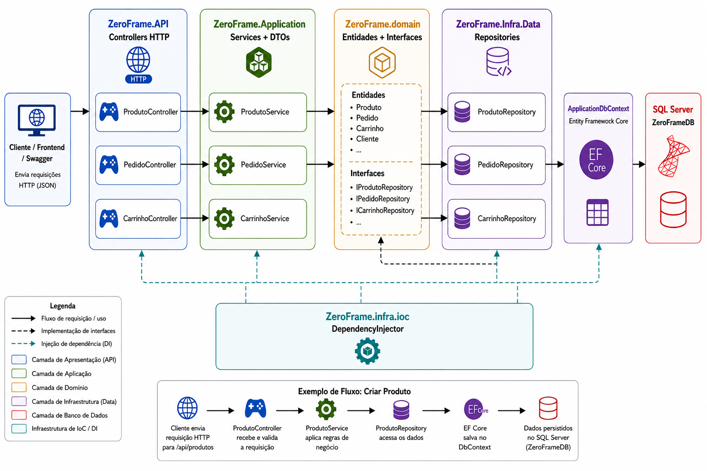

ZeroFrame 🛍️

📌 Visão Geral

O ZeroFrame é uma aplicação Full Stack de e-commerce desenvolvida com o objetivo de simular o funcionamento de uma loja virtual completa.

O projeto é composto por um front-end responsivo e interativo, responsável pela experiência do usuário, e uma API REST desenvolvida em ASP.NET Core, responsável pelas regras de negócio, autenticação, persistência de dados e comunicação com o banco de dados.

A aplicação permite realizar operações como cadastro e autenticação de usuários, gerenciamento de produtos, carrinho de compras, pedidos, pagamentos, endereços, avaliações e administração da loja.

---

🚀 Tecnologias Utilizadas

Back-end

- C#
- .NET / ASP.NET Core
- ASP.NET Core Web API
- Entity Framework Core
- SQL Server / LocalDB
- JWT Bearer
- Swagger / OpenAPI
- Arquitetura em Camadas
- Dependency Injection
- Git e GitHub

Front-end

- HTML5
- CSS3
- JavaScript
- React 18
- Babel Standalone
- Font Awesome
- Google Fonts
- LocalStorage

---

🏗️ Arquitetura do Sistema

O ZeroFrame utiliza separação entre Front-end, API e Banco de Dados.

O usuário não possui acesso direto ao banco de dados.

O fluxo principal da aplicação ocorre da seguinte forma:

Usuário
   

   

Front-end

   
   

HTTP / JSON

   
    

ZeroFrame API

     
    

Regras de Negócio

    

Entity Framework Core

  
    
SQL Server

A API recebe as requisições realizadas pelo front-end, valida os dados, executa as regras de negócio e utiliza o Entity Framework Core para acessar o banco de dados.

---

⚙️ Arquitetura do Back-end

A API utiliza Arquitetura em Camadas, separando responsabilidades e facilitando a manutenção e evolução da aplicação.

ZeroFrame

ZeroFrame.API

ZeroFrame.Application

ZeroFrame.Domain

ZeroFrame.Infra.Data

ZeroFrame.Infra.IoC

-----------------
ZeroFrame.API

Responsável por:

- Controllers
- Endpoints
- Configuração da aplicação
- Swagger
- Autenticação JWT
- Middlewares
- Recebimento das requisições HTTP

ZeroFrame.Application

Responsável por:

- Services
- DTOs
- Regras de aplicação
- Validações
- Comunicação entre API e domínio

ZeroFrame.Domain

Responsável por:

- Entidades
- Interfaces
- Regras relacionadas ao domínio

ZeroFrame.Infra.Data

Responsável por:

- Entity Framework Core
- "ApplicationDbContext"
- Repositórios
- Migrations
- Persistência dos dados
- Comunicação com SQL Server

ZeroFrame.Infra.IoC

Responsável por:

- Dependency Injection
- Registro dos serviços
- Registro dos repositórios
- Configuração das dependências da aplicação

---

🔄 Arquitetura da API

  

---

🔐 Autenticação e Autorização

O ZeroFrame utiliza autenticação baseada em JWT (JSON Web Token).

Após realizar login corretamente, a API gera um token que deve ser enviado pelo front-end nas requisições para endpoints protegidos.

Exemplo:

Authorization: Bearer TOKEN_JWT

O sistema possui diferentes níveis de acesso, permitindo separar funcionalidades disponíveis para usuários comuns e administradores.

---

👤 Usuários

A aplicação permite:

- Cadastro de usuários
- Login
- Geração de token JWT
- Consulta de usuário
- Atualização de dados
- Exclusão de usuário
- Controle de perfil
- Gerenciamento de conta

---

🏠 Endereços

Os usuários podem cadastrar e gerenciar seus endereços de entrega.

Funcionalidades:

- Cadastro de endereço
- Listagem de endereços
- Atualização
- Remoção
- Vinculação com usuário
- Seleção para realização de pedidos

---

📦 Produtos

O sistema possui gerenciamento completo de produtos.

Funcionalidades:

- Cadastro de produtos
- Listagem
- Consulta por ID
- Atualização
- Exclusão
- Controle de disponibilidade
- Imagens de produtos
- Associação com categorias
- Variações de produto

---

👕 Variações de Produto

Cada produto pode possuir diferentes variações.

Entre as informações controladas estão:

- Tamanho
- Cor
- Estoque

O estoque é controlado individualmente para cada variação.

---

🗂️ Categorias

A aplicação possui gerenciamento de categorias para organização dos produtos.

É possível realizar:

- Cadastro
- Listagem
- Atualização
- Exclusão

---

🛒 Carrinho de Compras

Cada usuário pode possuir um carrinho ativo.

O sistema permite:

- Criar carrinho
- Consultar carrinho ativo
- Adicionar produtos
- Alterar quantidade
- Remover itens
- Validar estoque
- Calcular valores

Adicionar um produto ao carrinho não reduz imediatamente o estoque.

O sistema apenas verifica se existe quantidade suficiente disponível.

---

📋 Pedidos

Os pedidos podem ser criados a partir dos produtos presentes no carrinho.

Durante a criação do pedido, o sistema:

1. Verifica o carrinho do usuário.
2. Valida os itens.
3. Verifica o estoque.
4. Copia o preço atual dos produtos.
5. Calcula o valor do pedido.
6. Registra os itens.
7. Reduz o estoque.
8. Finaliza o carrinho utilizado.

Isso permite preservar o valor do produto no momento da compra, mesmo que seu preço seja alterado posteriormente.

---

🚚 Status dos Pedidos

O pedido pode passar por diferentes estados durante seu ciclo:

Pendente
   ↓
Preparando para Saída
   ↓
Saiu para Entrega
   ↓
Entregue

Também é possível cancelar um pedido.

Quando ocorre o cancelamento, o sistema realiza a devolução das unidades ao estoque.

---

💳 Pagamentos

O sistema possui gerenciamento de pagamentos associados aos pedidos.

Funcionalidades:

- Criação de pagamento
- Associação com pedido
- Consulta de pagamento
- Alteração de status

O pagamento inicialmente é registrado como:

Pendente

E pode posteriormente assumir outros estados, como:

Aprovado
Recusado

«O projeto não utiliza integração com gateway de pagamento real. O módulo simula o gerenciamento do status de pagamento para fins acadêmicos e de demonstração.»

---

❤️ Favoritos

O front-end possui uma área destinada aos produtos favoritos do usuário.

Ela permite que produtos sejam salvos para consulta posterior durante a navegação pela loja.

---

⭐ Avaliação de Produtos

Os usuários podem avaliar produtos adquiridos ou disponíveis na plataforma.

As avaliações utilizam uma escala de:

1 ⭐
2 ⭐
3 ⭐
4 ⭐
5 ⭐

O sistema pode controlar avaliações vinculadas ao usuário e ao produto.

---

🚚 Cálculo de Frete

O projeto possui regras para cálculo de frete utilizando o valor da compra.

As regras de negócio são aplicadas pela aplicação antes da conclusão do pedido.

---

🛠️ Painel Administrativo

O ZeroFrame possui uma área administrativa para gerenciamento da loja.

O administrador possui acesso a funcionalidades específicas como:

- Gerenciamento de produtos
- Gerenciamento de categorias
- Controle de estoque
- Visualização de usuários
- Gerenciamento de pedidos
- Atualização de status dos pedidos
- Administração de conteúdo
- Moderação de informações da plataforma

---

📊 Principais Regras de Negócio

Algumas das regras implementadas no ZeroFrame incluem:

- O carrinho pertence a um usuário.
- Cada usuário possui um carrinho ativo.
- O carrinho não reduz estoque.
- A disponibilidade do estoque é validada ao adicionar produtos.
- O estoque é reduzido somente durante a criação do pedido.
- Um pedido só pode ser criado caso o carrinho possua itens válidos.
- O preço do produto é copiado para o item do pedido no momento da compra.
- O cancelamento de um pedido devolve os produtos ao estoque.
- Pagamentos são vinculados aos pedidos.
- O status do pagamento é controlado pela aplicação.
- Operações administrativas exigem autorização.
- Usuários podem possuir múltiplos endereços.
- Produtos podem possuir diferentes variações de tamanho, cor e estoque.

---

🗄️ Banco de Dados

O projeto utiliza SQL Server para armazenamento dos dados.

O acesso ao banco é realizado através do Entity Framework Core, utilizado como ORM (Object-Relational Mapper).

O EF Core realiza o mapeamento entre as entidades C# e as tabelas do banco.

As alterações na estrutura do banco são controladas através de Migrations.

---

🔗 Relacionamentos das Entidades

  

---

📦 Pacotes NuGet

A aplicação utiliza diferentes pacotes NuGet para autenticação, acesso ao banco de dados, documentação e infraestrutura.

  

---

🌐 Front-end

O front-end do ZeroFrame foi desenvolvido para oferecer uma experiência de navegação semelhante à de uma loja virtual moderna.

Entre os principais recursos estão:

- Página inicial
- Catálogo de produtos
- Pesquisa
- Filtros
- Página individual de produto
- Carrinho
- Favoritos
- Login
- Cadastro
- Gerenciamento de conta
- Endereços
- Histórico de pedidos
- Suporte
- Painel administrativo
- Tema claro e escuro
- Layout responsivo

---

🎨 Tema Claro e Escuro

O front-end possui suporte a Dark Mode.

A preferência selecionada pelo usuário é armazenada utilizando:

localStorage

Assim, o tema permanece salvo mesmo após fechar ou atualizar o navegador.

O modo escuro utiliza a classe:

modoescuro

aplicada ao elemento "body".

---

📱 Responsividade

O layout foi desenvolvido para funcionar em diferentes tamanhos de tela.

Foram utilizadas técnicas como:

- Media Queries
- Flexbox
- CSS Grid
- Layouts adaptáveis
- Componentes responsivos

Permitindo utilização tanto em computadores quanto em dispositivos móveis.

---

🧩 Componentes do Front-end

Entre os principais componentes estão:

Theme Toggle

componentes/theme-toggle.js

Responsável pela alternância entre tema claro e escuro.

---

Dropdown Menu

componentes/dropdown-menu/

Responsável pelo menu de usuário e suas interações.

---

Carrossel de Categorias

componentes/carrossel-categorias/

Componente criado utilizando React para exibição interativa das categorias.

---

Sliders

Utilizados em áreas como:

pages/produtos/slider/
pages/sobre/slider fundadores/

Responsáveis pela navegação entre imagens.

---

📄 Páginas Disponíveis

Página| Caminho| Descrição
Início| "index.html"| Página principal e produtos em destaque
Login| "pages/login-page/login.html"| Autenticação
Cadastro| "pages/register-page/register.html"| Cadastro de usuários
Busca| "pages/search/search.html"| Pesquisa e filtros
Carrinho| "pages/carrinho/carrinho.html"| Gerenciamento do carrinho
Favoritos| "pages/favoritos/favoritos.html"| Produtos favoritos
Produto| "pages/produtos/product.html"| Informações do produto
Endereços| "pages/meus-enderecos/enderecos.html"| Gerenciamento de endereços
Pedidos| "pages/meus-pedidos/pedidos.html"| Histórico de pedidos
Configurações| "pages/account-settings/account.html"| Configurações da conta
Administração| "pages/admin/admin.html"| Painel administrativo
Sobre| "pages/sobre/sobre.html"| Informações sobre a marca
Suporte| "pages/suporte/suporte.html"| Atendimento e contato

---

📁 Estrutura do Front-end

Front-end
│
├── index.html
├── style.css
│
├── assets/
│
├── componentes/
│   ├── theme-toggle.js
│   ├── dropdown-menu/
│   └── carrossel-categorias/
│
├── styles/
│
└── pages/
    ├── account-settings/
    ├── admin/
    ├── login-page/
    ├── register-page/
    ├── search/
    ├── carrinho/
    ├── favoritos/
    ├── meus-enderecos/
    ├── meus-pedidos/
    ├── produtos/
    ├── sobre/
    └── suporte/

---

🔌 Integração Front-end e Back-end

O front-end se comunica com a ZeroFrame API utilizando requisições HTTP.

Exemplo de endereço utilizado durante o desenvolvimento:

http://localhost:5140

A comunicação utiliza dados em formato JSON.

Exemplo simplificado:

fetch("http://localhost:5140/api/Produto")
    .then(response => response.json())
    .then(data => {
        console.log(data);
    });

Para endpoints protegidos, o token JWT é enviado no cabeçalho da requisição:

fetch("http://localhost:5140/api/recurso", {
    headers: {
        "Authorization": `Bearer ${token}`
    }
});

---

📚 Swagger

A API possui documentação interativa utilizando Swagger / OpenAPI.

Com a aplicação em execução, a documentação pode ser acessada localmente através de:

http://localhost:5140/swagger

O Swagger permite:

- Visualizar endpoints
- Ver parâmetros
- Consultar DTOs
- Testar requisições
- Enviar tokens JWT
- Visualizar respostas HTTP

---

▶️ Como Executar o Projeto

1. Clonar o projeto

git clone URL_DO_REPOSITORIO

Acesse o diretório:

cd ZeroFrame

---

2. Configurar o Banco de Dados

Configure a Connection String da API no arquivo:

appsettings.json

Exemplo utilizando SQL Server:

{
  "ConnectionStrings": {
    "DefaultConnection": "Server=(localdb)\\MSSQLLocalDB;Database=ZeroFrameDb;Trusted_Connection=True;"
  }
}

---

3. Restaurar as dependências

No diretório da solução:

dotnet restore

---

4. Aplicar as Migrations

dotnet ef database update

---

5. Executar a API

dotnet run --project ZeroFrame.API

A API ficará disponível no endereço configurado pela aplicação.

Durante o desenvolvimento:

http://localhost:5140

---

6. Executar o Front-end

Após iniciar a API, execute o front-end utilizando um servidor local.

Por exemplo, através da extensão Live Server do Visual Studio Code.

Abra:

index.html

Com a API em funcionamento, o front-end poderá realizar as requisições aos endpoints do sistema.

---

🔒 Segurança

Algumas das práticas utilizadas no projeto incluem:

- Autenticação JWT
- Autorização baseada em perfil
- Endpoints protegidos
- Senhas armazenadas utilizando hash
- Separação de responsabilidades
- Validação de dados
- DTOs para comunicação entre camadas
- Middleware para tratamento de erros
- Controle de acesso administrativo

---

🎯 Objetivo do Projeto

O ZeroFrame foi desenvolvido como projeto acadêmico e de portfólio com o objetivo de aplicar na prática conceitos de desenvolvimento de software e desenvolvimento Full Stack.

Durante o desenvolvimento foram trabalhados conceitos como:

- Desenvolvimento de APIs REST
- Programação Orientada a Objetos
- Arquitetura em Camadas
- ASP.NET Core
- Entity Framework Core
- Banco de Dados Relacional
- SQL Server
- Autenticação e Autorização
- JWT
- Regras de Negócio
- Integração Front-end / Back-end
- Consumo de APIs
- Git e GitHub
- HTML
- CSS
- JavaScript
- Desenvolvimento responsivo

O projeto busca representar não apenas operações CRUD, mas também fluxos e regras de negócio presentes em aplicações reais de e-commerce.

---

Projeto desenvolvido para fins acadêmicos, aprendizado e portfólio profissional.
